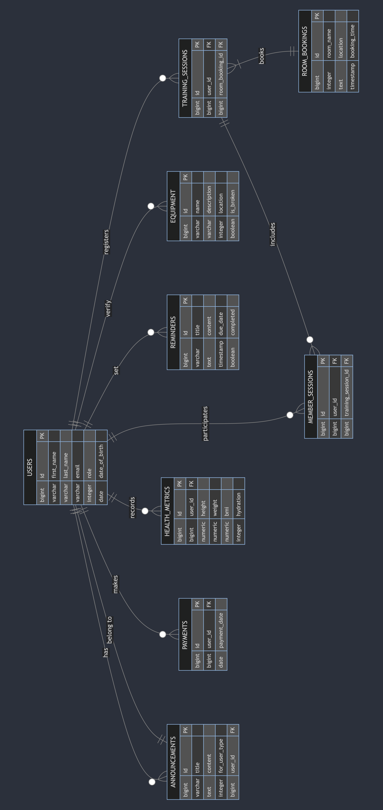
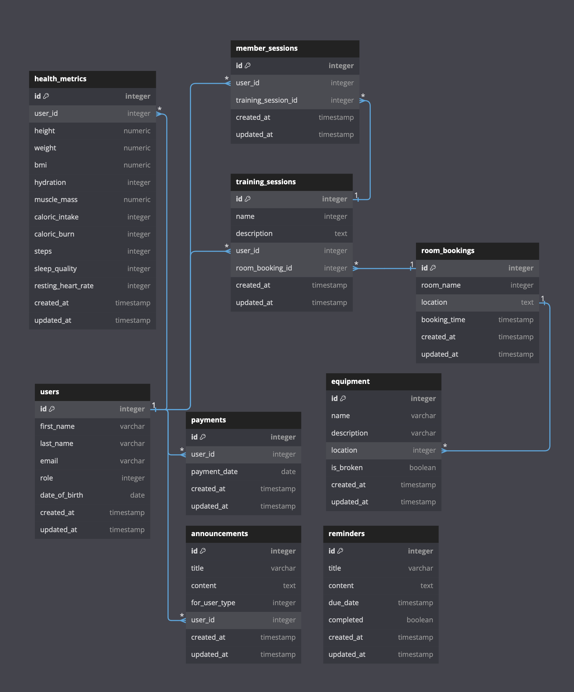

# MADHAV MAKKENA - 101284711

## Prerequisites

Before you begin, ensure you have met the following requirements:

- You have installed the latest version of `ruby`, `Rails`, and `rbenv`
- This app was build on:
  - `ruby 3.3.0`
  - `Rails 7.1.3.2`
  - `rbenv 1.2.0`

## Installation requirements
- Clone the repo `git clone https://github.com/MadhavMakkena/COMP3005_HFC.git`
- Navigate to project directory and run the following in your terminal
- Install the required gems: `bundle install`
- Setup the database: `rails db:create && rails db:migrate`
- Seed the database: `rake db:build`
- NOTE: If you want to reset the whole database, run `rake db:rebuild`

## Starting the app
- Start the Rails server: `rails server`
- Navigate to `http://127.0.0.1:3000` or `http://localhost:3000` or the specified address in `rails server` logs

## Paths to important files:
- Relative to the repo directory
- [DML File](db/seeds.sql) - `./db/seeds.sql`
- [DDL File](db/structure.sql) - `./db/structure.sql`
- ER Diagram - `./er_diagram.png`
- Relational Schema Diagram - `./relational_schema.png`

## Video Demo
https://youtu.be/3KpgrYQCXMU 

## Conceptual Design (Assumptions)
- Members can make multiple payments, have multiple health metric logs, attend training sessions
- Each Training Session is associated with a Room Booking and can have multiple member's attending it
- Equipment, and Room Bookings are independent entities but are related to specific locations
- All foreign keys in the tables define relationships and participation is mostly optional, indicating zero to many relationships unless otherwise specified
- User roles are based on enums and relationships are scoped to the role

## Entities:
- Users
- Announcements
- Equipment
- Health Metrics
- Member Sessions
- Payments
- Reminders
- Room Bookings
- Training Sessions

## Relationships:
- Users to Announcements (one-to-many) [based on user role]
- Users to Payments (one-to-many) [based on user role]
- Users to Health Metrics (one-to-many) [based on user role]
- Users to Member Sessions (one-to-many) [based on user role]
- Training Sessions to Room Bookings (many-to-one)
- Training Sessions to Member Sessions (one-to-many)

## ER Diagram:

## Reduction to Relation Schemas:
- Users Table
  - Primary Key: id
  - Attributes: first_name, last_name, email, role, date_of_birth
- Announcements Table
  - Primary Key: id
  - Foreign Key: user_id (references Users)
  - Attributes: title, content, for_user_type
- Payments Table
  - Primary Key: id
  - Foreign Key: user_id (references Users)
  - Attributes: payment_date
- Health Metrics Table
  - Primary Key: id
  - Foreign Key: user_id (references Users)
  - Attributes: height, weight, bmi, hydration
- Member Sessions Table
  - Primary Key: id
  - Foreign Keys:
  - user_id (references Users)
  - training_session_id (references Training Sessions)
- Training Sessions Table
  - Primary Key: id
  - Foreign Keys:
  - user_id (references Users)
  - room_booking_id (references Room Bookings)
- Room Bookings Table
  - Primary Key: id
  - Attributes: room_name, location, booking_time
- Equipment Table
  - Primary Key: id
  - Attributes: name, description, location, is_broken
- Reminders Table
  - Primary Key: id
  - Attributes: title, content, due_date, completed

## Relation Schema Diagram:

